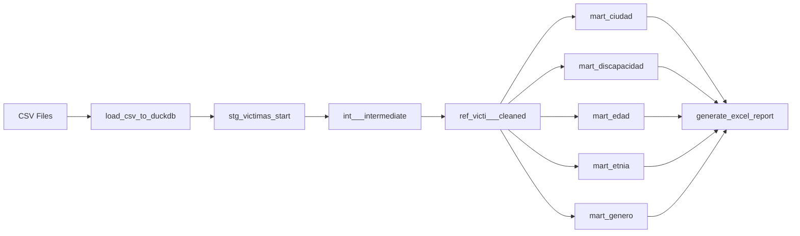

# Pipeline de Datos con Dagster y DBT

Pipeline automatizado de ingesta, transformación y generación de reportes utilizando Dagster como orquestador y DBT para las transformaciones de datos.

## Descripción del Proyecto

Este proyecto implementa un pipeline de datos end-to-end que:

1. **Ingesta datos** desde archivos CSV a una base de datos DuckDB
2. **Transforma datos** utilizando modelos DBT organizados en capas (staging, intermediate, refined, marts)
3. **Genera reportes** en formato Excel con visualizaciones automáticas

### Tecnologías Principales

- **Dagster**: Orquestador de datos moderno que gestiona el ciclo de vida completo del pipeline
- **DBT (Data Build Tool)**: Herramienta de transformación de datos que implementa las mejores prácticas de ingeniería de datos
- **DuckDB**: Base de datos analítica embebida de alto rendimiento
- **Polars & Pandas**: Bibliotecas de procesamiento de datos
- **Matplotlib**: Generación de visualizaciones
- **XlsxWriter**: Creación de archivos Excel con gráficos

## Estructura del Proyecto

```
dagster_code/
├── src/
│   └── dagster_code/
│       ├── __init__.py                    # Módulo principal
│       ├── definitions.py                 # Definiciones de Dagster
│       └── defs/
│           ├── assets/                    # Assets organizados por función
│           │   ├── __init__.py
│           │   ├── ingestion_assets.py    # Carga de datos CSV → DuckDB
│           │   ├── dbt_assets.py          # Transformaciones DBT
│           │   └── reporting_assets.py    # Generación de reportes Excel
│           ├── assets.py                  # Punto de entrada de assets
│           ├── resources.py               # Recursos (DuckDB, DBT)
│           └── schedules.py               # Programación de ejecuciones
├── tests/
│   ├── __init__.py
│   └── asset_checks.py                    # Validaciones de calidad (Asset Checks)
├── dbt_code/                              # Proyecto DBT
│   ├── dbt_project.yml                    # Configuración DBT
│   ├── profiles.yml                       # Perfiles de conexión
│   ├── models/
│   │   ├── staging/                       # Capa de staging
│   │   ├── intermediate/                  # Transformaciones intermedias
│   │   ├── refined/                       # Datos refinados
│   │   └── marts/                         # Marts analíticos
│   └── target/
│       └── manifest.json                  # Manifest DBT (generado)
├── data/
│   ├── raw/                               # Datos de entrada
│   ├── duckdb/                            # Base de datos DuckDB
│   ├── output/                            # Datos procesados
│   └── report/                            # Reportes generados
├── pyproject.toml                         # Configuración del proyecto
└── README.md                              # Este archivo
```

## Características del Pipeline

### 1. Ingesta de Datos (ingestion)
- Carga automática de archivos CSV con encoding configurable
- Validación de datos en el punto de ingesta
- Metadata tracking de registros y columnas

### 2. Transformaciones DBT (dbt_models y dbt_marts)
- **Staging**: Limpieza inicial y estandarización
- **Intermediate**: Lógica de negocio y joins
- **Refined**: Datos validados y enriquecidos
- **Marts**: Tablas analíticas optimizadas para reportes

### 3. Generación de Reportes (reporting)
- Reportes Excel automatizados con múltiples hojas
- Gráficos de barras, pastel y visualizaciones personalizadas
- Exportación con formato profesional

### 4. Orquestación con Dagster
- **Grupos de assets** organizados por función
- **Dependencias automáticas** entre assets
- **Scheduling** configurable
- **UI visual** para monitoreo y ejecución
- **Asset Checks** para validación de calidad de datos

### 5. Validación de Calidad (Asset Checks)
- Validaciones automáticas después de cada materialización
- Checks blocking y non-blocking para control de flujo
- Métricas de calidad de datos en tiempo real
- Historial completo de validaciones en la UI

## Instalación

### Prerequisitos

- Python 3.10 - 3.13
- [uv](https://docs.astral.sh/uv/) (recomendado) o pip

### Paso 1: Clonar el repositorio

```bash
git clone <repository-url>
cd dagster_code
```

### Paso 2: Instalar dependencias

**Opción A: Usando uv (Recomendado)**

```bash
# Instalar uv si no lo tienes
# Windows (PowerShell)
powershell -ExecutionPolicy ByPass -c "irm https://astral.sh/uv/install.ps1 | iex"

# Sincronizar dependencias y crear ambiente virtual
uv sync

# Activar ambiente virtual
.venv\Scripts\activate  # Windows
source .venv/bin/activate  # Linux/Mac
```

**Opción B: Usando pip**

```bash
# Crear ambiente virtual
python -m venv .venv

# Activar ambiente virtual
.venv\Scripts\activate  # Windows
source .venv/bin/activate  # Linux/Mac

# Instalar dependencias
pip install -e ".[dev]"
```

### Paso 3: Generar manifest de DBT

```bash
cd dbt_code
dbt parse --profiles-dir .
cd ..
```

### Paso 4: Ejecutar Dagster

```bash
dagster dev
```

El servidor web estará disponible en: `http://localhost:3000`

## Uso del Pipeline

### Ejecución Manual

1. Abrir la UI de Dagster en `http://localhost:3000`
2. Navegar a la pestaña "Assets"
3. Seleccionar los assets a materializar
4. Click en "Materialize selected"

### Ejecución Programada

El pipeline incluye un schedule configurado que se ejecuta cada 5 minutos (configurable en `schedules.py`):

```python
pipeline_schedule = dg.ScheduleDefinition(
    name="pipeline_schedule_5min",
    cron_schedule="*/5 * * * *",
    target="*",
    default_status=dg.DefaultScheduleStatus.RUNNING,
)
```

### Flujo de Ejecución



## Configuración

### Modificar Schedule

Editar `src/dagster_code/defs/schedules.py`:

```python
pipeline_schedule = dg.ScheduleDefinition(
    name="pipeline_schedule_daily",
    cron_schedule="0 9 * * *",  # Diario a las 9 AM
    target="*",
)
```

### Agregar Nuevos Assets

Crear assets en los archivos correspondientes:
- **Ingesta**: `assets/ingestion_assets.py`
- **Transformaciones**: Agregar modelos en `dbt_code/models/`
- **Reportes**: `assets/reporting_assets.py`

### Personalizar Reportes

Modificar las funciones de visualización en `reporting_assets.py`:
- `_create_bar_chart()`: Gráficos de barras
- `_create_vertical_bar_chart()`: Gráficos verticales
- `_create_pie_chart()`: Gráficos de pastel

### Agregar Validaciones (Asset Checks)

Crear nuevos checks en `defs/checks.py`:

```python
@dg.asset_check(asset="tu_asset", blocking=False)
def check_tu_validacion(duckdb: DuckDBResource) -> dg.AssetCheckResult:
    """Descripción de la validación"""
    # Lógica de validación
    resultado = validar()
    
    return dg.AssetCheckResult(
        passed=resultado,
        description="Mensaje descriptivo",
        metadata={"metrica": dg.MetadataValue.int(100)}
    )
```

Ver [ASSET_CHECKS.md](dagster_code/ASSET_CHECKS.md) para documentación completa.

## Validación de Calidad de Datos

El pipeline incluye **15+ asset checks** automáticos que validan:

✅ Existencia de tablas y schemas  
✅ Presencia de datos (no vacío)  
✅ Recuentos mínimos de registros  
✅ Estructura de columnas esperada  
✅ Creación exitosa de reportes  

Los checks se ejecutan automáticamente después de materializar cada asset y los resultados se visualizan en la UI de Dagster. Ver detalles en [ASSET_CHECKS.md](dagster_code/ASSET_CHECKS.md).

## Monitoreo

Dagster proporciona:
- **Lineage visual**: Visualización de dependencias entre assets
- **Asset Checks**: Validaciones de calidad en tiempo real
- **Logs detallados**: Seguimiento de ejecuciones
- **Metadata tracking**: Métricas de cada asset
- **Run history**: Historial de ejecuciones

## Desarrollo

### Ejecutar Tests DBT

```bash
cd dbt_code
dbt test --profiles-dir .
```

### Validar Configuración

```bash
dagster-cli api list-jobs
```

### Hot Reload

Dagster detecta cambios automáticamente. Los cambios en código Python se reflejan inmediatamente en la UI.

## Notas Adicionales

- Los archivos temporales se limpian automáticamente después de generar reportes
- La base de datos DuckDB se crea automáticamente en `data/duckdb/`
- Los reportes se guardan en `data/report/` con timestamp

## Contribuciones

Para contribuir al proyecto:
1. Crear una rama feature
2. Hacer cambios y tests
3. Crear pull request


Open http://localhost:3000 in your browser to see the project.

## Learn more

To learn more about this template and Dagster in general:

- [Dagster Documentation](https://docs.dagster.io/)
- [Dagster University](https://courses.dagster.io/)
- [Dagster Slack Community](https://dagster.io/slack)
